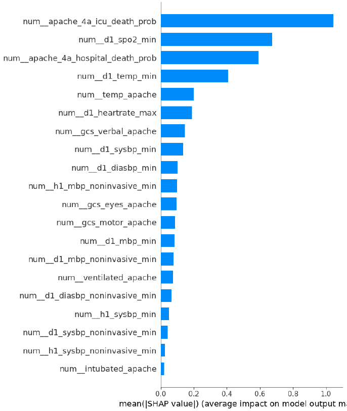
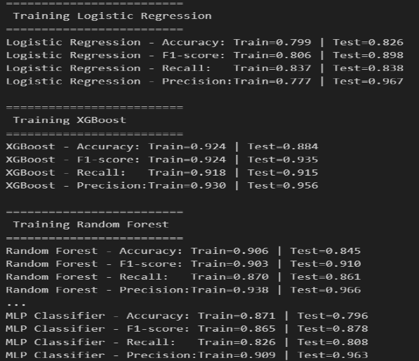

# Patient Survival Prediction using EHR Data

Predict patient survival (mortality) using Electronic Health Records (EHR) with machine learning.  
This project uses multiple ML models, handles class imbalance, and interprets predictions with SHAP.

---

## 🗂 Project Structure

- `Dataset/` : Original dataset(https://www.kaggle.com/competitions/patient-survival-prediction/data) 
- `Notebooks/` : EDA, preprocessing, feature engineering, and model building in Colab   

---

## 📊 Dataset

- Source: **[Patient Survival Prediction]**  
- Rows: 91,713
- Columns: 85  
- Features: Demographics, vitals, lab results, ICU scores (APACHE)  
- Target: `survived` (0 = Died, 1 = Survived)  
- Class distribution: Imbalanced → handled using **SMOTE** and **class-weighted models**

---

## 🛠 Approach

1. **Data Cleaning & Preprocessing**
   - Handle missing values using mean/median/mode
   - Remove duplicates
   - Encode categorical variables
   - Scale numeric features

2. **Feature Selection**
   - ANOVA F-test, Mutual Information, Lasso

3. **Modeling**
   - Logistic Regression (with Polynomial Features)
   - Random Forest (class_weight='balanced')
   - XGBoost
   - SVM, MLP Classifier
   - Train/Test split with stratification

4. **Class Imbalance Handling**
   - SMOTE oversampling on training data
   - Class-weight balancing in models

5. **Model Evaluation**
   - Accuracy, F1-score, Recall, Precision
   - ROC-AUC and confusion matrix

6. **Interpretability**
   - SHAP TreeExplainer on XGBoost for feature importance and individual predictions

---

## 📈 Results

- **Top predictive features:** ICU death probability, SpO₂ min, temperature min, Glasgow Coma Scale, ventilated status  
- **Best performing model:** XGBoost (Accuracy: ~0.88, F1-score: ~0.93, ROC-AUC: ~0.88)  
- **SHAP insights:**  
  - High ICU mortality probability → increases predicted death  
  - Low oxygen saturation → higher mortality risk  
  - Ventilated patients → higher predicted death risk  

*Example SHAP Summary Plot:*  


*Example MODEL COMPARISION:*  


*Example ROC-AUC:*  


---

## ⚙ How to run

1. Clone the repo:

```bash
git clone https://github.com/<your_username>/patient_survival_ml.git
cd patient_survival_ml
